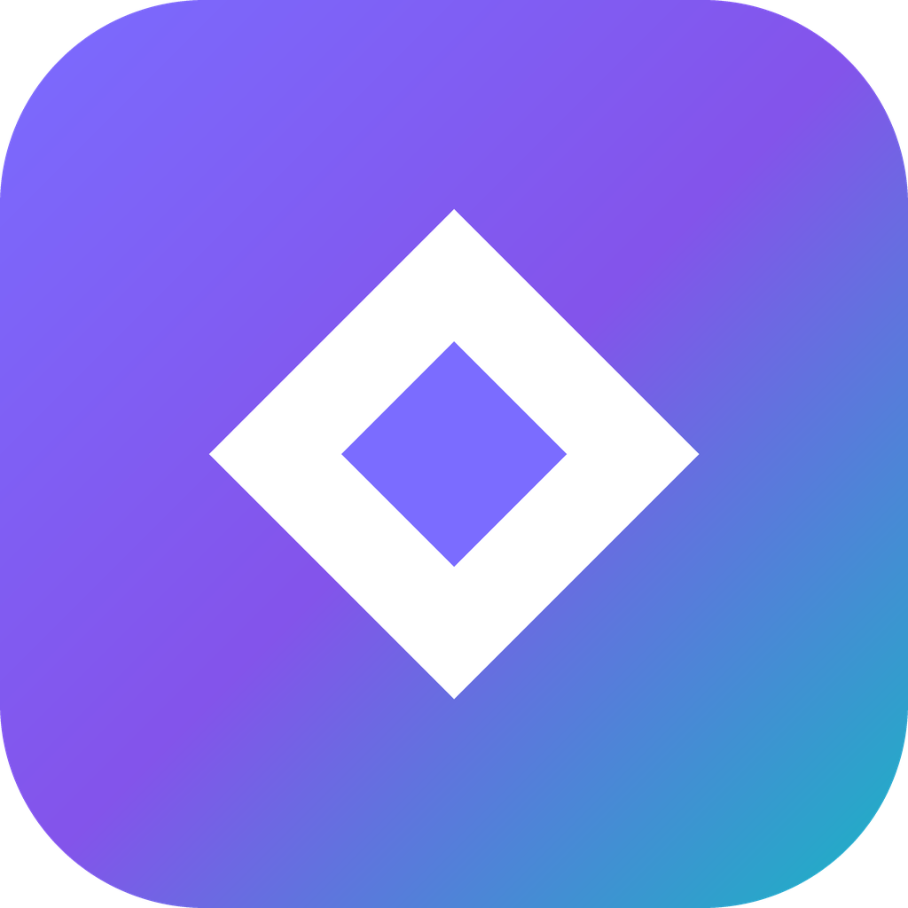
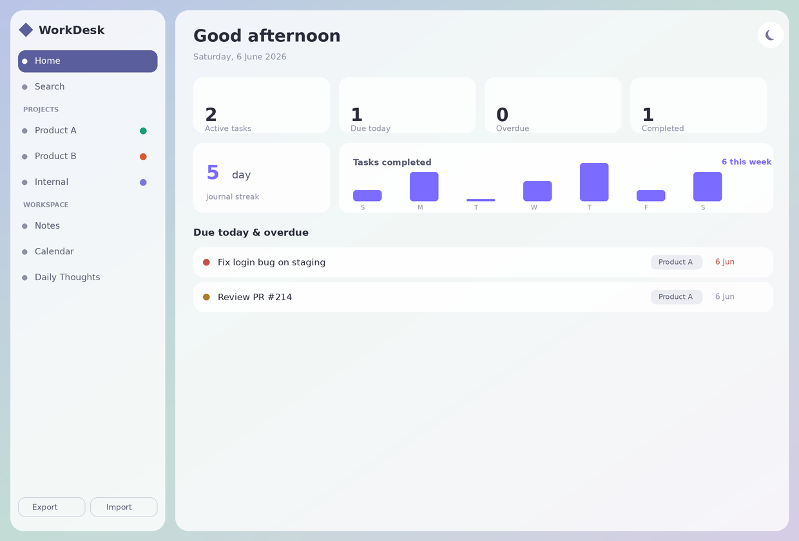
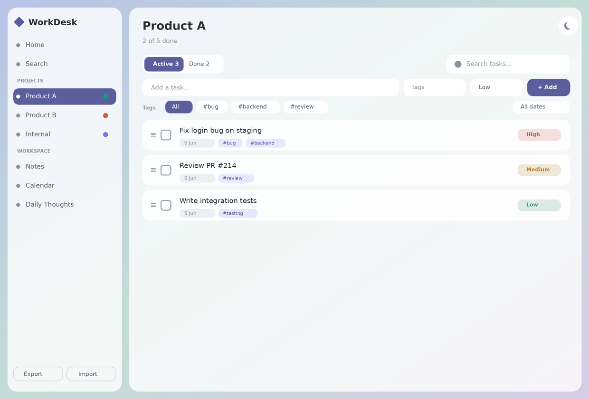
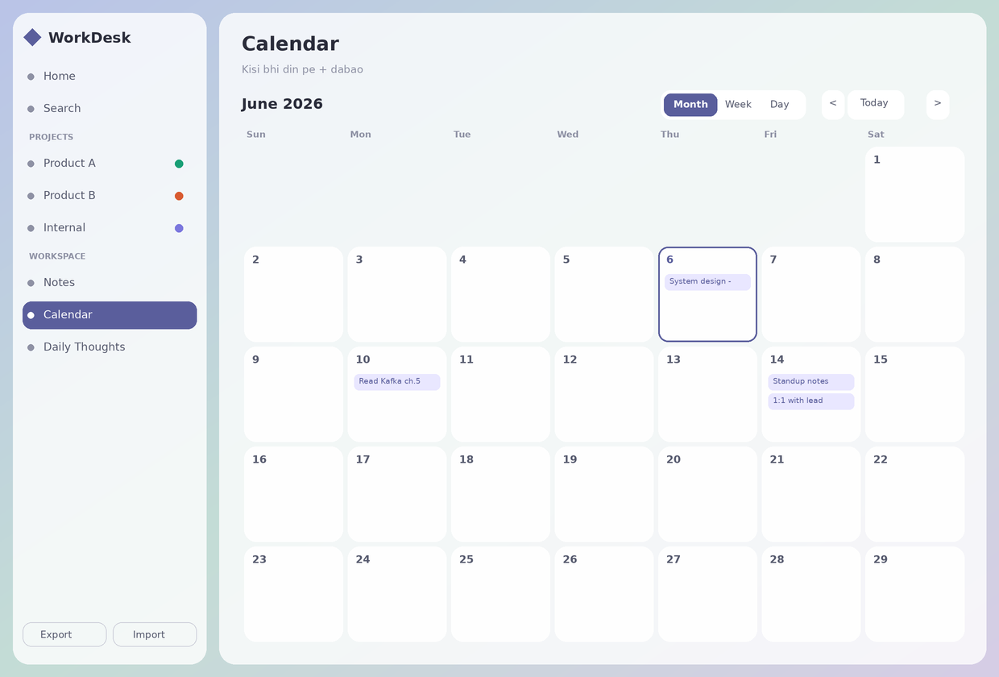

<div align="center">



# WorkDesk

**A calm, offline-first desktop app for your tasks, notes & daily journal — organised by project.**

Built for people who juggle work across multiple teams and products, and want one private place to keep todos, thoughts, and a daily log.


</div>

---

## 📸 Screenshots

<div align="center">



<sub><em>Home — today's tasks, journal streak 🔥 and weekly progress at a glance</em></sub>

<br/><br/>



<sub><em>Project tasks — priority, tags, due dates, Active / Completed boards and filters</em></sub>

<br/><br/>



<sub><em>Calendar — log what you read / did each day, Month / Week / Day views</em></sub>

</div>

---

## ✨ Features

### 🏠 Dashboard
A home screen that greets you and shows what matters today — active tasks, items **due today / overdue**, your **journal streak** 🔥, a **7-day completion chart**, today's journal entries, and recent notes. Everything is one click away.

### 📁 Projects & tasks
- Unlimited **project folders**, each with a custom **emoji icon and colour**
- Tasks with **priority** (high / medium / low), **tags**, **due dates** and **created dates**
- **Subtasks** (checklists) with progress, and **recurring tasks** (daily / weekly / monthly) that auto-reschedule when completed
- **Drag-and-drop** reordering, a separate **Completed board**, and **move tasks between folders**
- Filter by **tag, priority, date range**, plus a folder-level search

### 📝 Notes
Sticky-note style cards that open in a focused **modal editor** with **Markdown** support and live preview. **Pin** favourites to the top and organise with **tags**.

### 💡 Daily journal & calendar
A Notion-style **calendar** with **Month / Week / Day** views. Click any day's **＋** to log "what I read / did today". Entries show as chips on the calendar and group by date in the journal list.

### 🔍 Global search
One command-palette search (`/`) across **tasks, notes and journal** — jump straight to any item.

### 🎨 Look & feel
Glassmorphism UI with an animated aurora background, smooth **light / dark theme** toggle, and gentle browser **due-date reminders**.

### 💾 Your data, your file
Everything is stored locally in a single **`db.json`** file — no account, no cloud, no tracking. One-click **JSON export / import** for backup or moving between machines.

---

## 🚀 Getting started

### Prerequisites
- [Node.js](https://nodejs.org) (LTS) — check with `node --version`

### Run in development
```bash
npm install      # one time — downloads Electron
npm start         # launches the WorkDesk window
```

### Build a real desktop app
```bash
npm run dist:mac    # → dist/WorkDesk-x.x.x.dmg  (macOS)
npm run dist:win    # → Windows installer
npm run dist        # build for your current OS
```
The finished app lands in `dist/`. Drag it to Applications (macOS) and launch it like any normal app.

> First launch on macOS may show an "unidentified developer" warning (the app isn't code-signed). Right-click → **Open** once to allow it.

---

## 💾 Where your data lives

WorkDesk runs in three modes and adapts automatically:

| Mode | How to run | Storage |
|------|------------|---------|
| **Desktop app** (recommended) | `npm start` or the built app | `db.json` — read/written directly |
| **Local server** | `node server.js` → http://localhost:4321 | `db.json` via a tiny API |
| **Plain browser** | open `WorkDesk.html` directly | browser `localStorage` |

In the packaged desktop app, `db.json` lives in your OS user-data folder (e.g. `~/Library/Application Support/WorkDesk/` on macOS) so it's always writable.

---

## 🗂 Project structure

```
workdesk/
├── WorkDesk.html     # the entire app — UI, styles & logic in one file
├── main.js           # Electron main process (reads/writes db.json)
├── preload.js        # safe bridge exposing window.workdesk
├── server.js         # optional local-server mode
├── package.json      # scripts + electron-builder config
├── build/
│   └── icon.png      # app icon
└── db.json           # your data (created on first run — git-ignored)
```

---

## 🛠 Tech stack

- **Vanilla HTML / CSS / JavaScript** — no framework, no build step for the UI
- **Electron** — wraps it into a native cross-platform desktop app
- **electron-builder** — packages installers for macOS / Windows / Linux
- Zero runtime dependencies in the app itself; data persisted as plain JSON

---

## 📄 License

MIT — free to use, modify and share.

<div align="center">
<sub>Made with ◆ for staying organised across every project.</sub>
</div>
